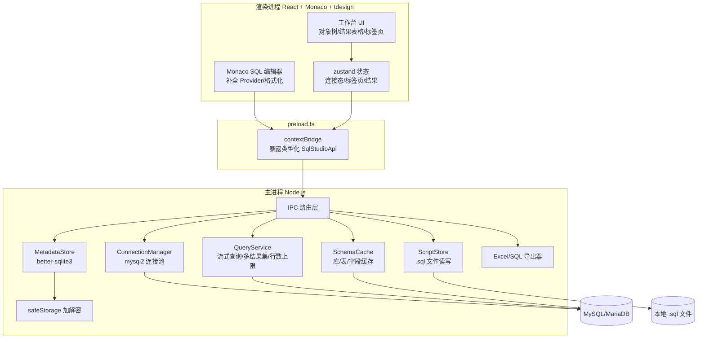

## 产品概述

一个面向数据分析师（主要写 SQL）的桌面级 SQL 工具平台，对标 Navicat 的核心体验：桌面应用形态，通过编写 SQL 连接 MySQL/MariaDB 完成查询、脚本管理与结果导出，作为可持续维护的项目，替代原有的 web_sql_pro（该目录保留不动，仅作功能参考）。

## 核心功能

- **多数据库连接管理**：配置多个 MySQL/MariaDB 连接（主机/端口/用户/密码/默认库/字符集），支持新增、编辑、删除、测试连接、连接状态指示；密码本地加密存储。
- **SQL 编辑器**：基于 Monaco，语法高亮、智能补全（关键字 + 已连接库的表名/字段名/库名）、SQL 格式化、选区执行与 Ctrl+Enter 执行、多标签页；**语义化高亮**——已连接库的表名/字段名/库名通过实时 schema 动态注入，与关键字、普通标识符使用不同颜色区分，一眼可辨（对标 Navicat/DataGrip）。
- **脚本管理**：新建/打开/保存/另存为 .sql 脚本文件，文件系统持久化，标签页未保存状态标记，可直接导出 SQL。
- **查询执行与结果展示**：一次执行多条语句返回多结果集；结果表格支持排序、按列筛选、双击复制；大数据量行数上限保护；展示执行耗时与影响行数。
- **对象浏览器**：连接 → 数据库 → 表 → 字段树形浏览，查看表结构 DDL 与数据预览，双击表自动生成 SELECT。
- **数据导出**：导出 Excel（全量/当前筛选结果）；将结果集导出为 SQL INSERT 语句（对标 Navicat 导出 SQL）。
- **历史与收藏**：SQL 执行历史（一键回填编辑器）、命名收藏常用 SQL，本地持久化。

## 技术栈

- **Electron（最新稳定版）**：桌面应用壳，主进程持数据库连接与文件系统能力
- **Vite + React 18 + TypeScript**：渲染进程，可维护性优先
- **Monaco Editor（@monaco-editor/react）**：SQL 编辑器（高亮/补全/多标签）
- **mysql2**：主进程连接 MySQL/MariaDB（连接池 + 流式查询）
- **better-sqlite3**：本地元数据库（连接配置/历史/收藏），需 electron-rebuild
- **ExcelJS**：Excel 导出（主进程，样式对齐旧项目 exporter.py）
- **sql-formatter**：SQL 美化（MySQL 方言）
- **tdesign-react**：UI 组件（表格/树/标签页/弹窗/表单）
- **zustand**：渲染进程状态管理；**electron-log**：主进程日志
- **electron-builder**：Windows 打包（NSIS 安装包）

## 架构设计

采用「渲染进程 → preload（类型化 IPC）→ 主进程服务层 → 驱动」的单向分层架构。渲染进程不直连数据库，一切数据库操作、文件读写、加密均经 IPC 走主进程；密码用 Electron safeStorage 加密后落 SQLite。



## 实现要点

- **智能补全**：连接成功后由主进程拉取库/表/字段写入 SchemaCache（内存），Monaco 注册 `registerCompletionItemProvider` 按上下文注入关键字 + 标识符；支持手动刷新失效缓存。
- **表名/字段名语义高亮**：基于 SchemaCache 动态生成当前连接的标识符集合（库名/表名/字段名），通过自定义 Monarch tokenizer（继承 SQL 语法并注入标识符关键字表）+ 编辑器主题 token 颜色，让表名/字段名/库名与关键字、普通标识符呈现不同配色；连接切换或 schema 刷新时同步重建高亮规则。
- **大数据量**：mysql2 流式读取 + `MAX_RESULT_ROWS`（默认 5 万行）上限保护，结果表格虚拟滚动只渲染可视区；导出全量时在主进程重新流式查询，避免内存打爆。
- **连接池**：每个已保存连接按需创建 mysql2 pool，空闲超时销毁；测试连接用临时单连接，不写库。
- **多结果集**：启用 `multipleStatements`，按语句拆分执行并分别返回；与旧项目一致，工具定位为"连接自己的库"，写入类 SQL 执行前在 UI 弹确认提示。
- **安全**：密码经 safeStorage 加密后存 SQLite（userData 目录）；日志只记录 SQL 摘要与行数/耗时，不落密码与完整 SQL。
- **脚本持久化**：标签页 `{id, filePath?, sql, isDirty}`，打开/保存走系统对话框（.sql 过滤器），关闭未保存标签时二次确认。

## 目录结构

```
SQL_project/
├── package.json                  # 依赖与脚本（dev/build/rebuild 原生模块）
├── electron-builder.yml          # 打包配置（NSIS 安装包、图标）
├── vite.config.ts                # 渲染进程构建 + 主/预加载 esbuild 构建
├── index.html                    # 渲染进程入口
├── src/
│   ├── shared/types.ts           # [NEW] 主/渲染共享类型（ConnectionConfig/QueryResult/EditorTab 等）
│   ├── main/
│   │   ├── index.ts              # [NEW] 主进程入口：创建窗口、加载 preload、生命周期
│   │   ├── ipc.ts                # [NEW] IPC 路由注册（连接/查询/脚本/对象/导出/历史）
│   │   └── services/
│   │       ├── connection-manager.ts # [NEW] mysql2 连接池管理：复用/销毁、测试连接
│   │       ├── metadata-store.ts     # [NEW] better-sqlite3：connections/history/favorites CRUD
│   │       ├── security.ts           # [NEW] safeStorage 加解密密码
│   │       ├── schema-cache.ts       # [NEW] 库/表/字段缓存（补全与对象树共用），支持刷新
│   │       ├── script-store.ts       # [NEW] .sql 脚本读写（dialog 选路径、UTF-8）
│   │       ├── query-service.ts      # [NEW] SQL 执行：流式读取、行数上限、多结果集、耗时统计
│   │       ├── excel-exporter.ts     # [NEW] ExcelJS 导出（全量/筛选结果，表头样式/冻结窗格）
│   │       └── sql-exporter.ts       # [NEW] 结果集转 INSERT 语句导出（值转义、分批）
│   ├── preload/index.ts          # [NEW] contextBridge 暴露类型化 window.sqlStudio API
│   └── renderer/
│       ├── main.tsx / App.tsx    # [NEW] React 入口与整体工作台布局
│       ├── components/
│       │   ├── ConnectionPanel.tsx   # [NEW] 连接列表与新建/编辑/测试连接弹窗
│       │   ├── ObjectTree.tsx        # [NEW] 库/表/字段树（懒加载）+ 右键菜单（DDL/预览/新查询）
│       │   ├── EditorTabs.tsx        # [NEW] 脚本标签页（未保存标记/关闭确认/文件路径显示）
│       │   ├── SqlEditor.tsx         # [NEW] Monaco 封装（SQL 语言配置、动态 tokenizer 语义高亮、补全 provider、格式化、Ctrl+Enter）
│       │   ├── ResultTabs.tsx        # [NEW] 多结果集标签 + 状态栏（耗时/行数/截断提示）
│       │   ├── ResultGrid.tsx        # [NEW] 虚拟滚动表格（排序/筛选/双击复制）
│       │   ├── HistoryPanel.tsx      # [NEW] 历史记录与收藏面板（回填/删除/收藏）
│       │   └── ExportMenu.tsx        # [NEW] 导出菜单（Excel / SQL INSERT）
│       ├── hooks/useIpc.ts           # [NEW] 封装 preload API 的 hooks
│       ├── store/workspace.ts        # [NEW] zustand：连接态/标签页/结果/历史状态
│       └── styles/theme.css          # [NEW] tdesign 主题变量与深浅色切换
└── docs/
    ├── README.md                     # [NEW] 项目说明与快速开始
    ├── 架构文档.md                    # [NEW] 架构分层与数据流
    └── 开发文档.md                    # [NEW] IPC 接口速查与扩展指南
```

## 关键代码结构

```ts
// src/shared/types.ts —— 核心共享类型
export interface ConnectionConfig {
  id: string;
  name: string;
  host: string;
  port: number;
  user: string;
  password: string;      // 仅主进程解密后持有，渲染进程不落盘
  database?: string;
  charset?: string;
  createdAt: number;
}

export interface QueryResult {
  connectionId: string;
  sql: string;
  cols: string[];
  rows: Record<string, unknown>[];
  rowCount: number;
  truncated: boolean;
  durationMs: number;
  affectedRows?: number;
}

export interface EditorTab {
  id: string;
  filePath?: string;
  sql: string;
  isDirty: boolean;
}
```

```ts
// src/preload/index.ts —— IPC 接口契约（渲染进程唯一数据入口）
export interface SqlStudioApi {
  connections: {
    list(): Promise<ConnectionSummary[]>;
    save(cfg: ConnectionInput): Promise<ConnectionConfig>;
    remove(id: string): Promise<void>;
    test(cfg: ConnectionInput): Promise<{ ok: boolean; message?: string }>;
  };
  query: {
    execute(connectionId: string, sql: string): Promise<QueryResult[]>;
    cancel(): Promise<void>;
  };
  schema: {
    listDatabases(connectionId: string): Promise<string[]>;
    listTables(connectionId: string, db: string): Promise<TableMeta[]>;
    getColumns(connectionId: string, db: string, table: string): Promise<ColumnMeta[]>;
    getDdl(connectionId: string, db: string, table: string): Promise<string>;
  };
  scripts: {
    open(): Promise<EditorTab | null>;
    save(tab: EditorTab): Promise<EditorTab>;
    saveAs(tab: EditorTab): Promise<EditorTab>;
  };
  export: {
    excel(connectionId: string, sql: string, opts: ExcelOptions): Promise<string>;
    sqlInsert(connectionId: string, sql: string, opts: SqlInsertOptions): Promise<string>;
  };
  history: {
    list(limit?: number): Promise<HistoryItem[]>;
    add(item: HistoryItemInput): Promise<void>;
    favorites: {
      list(): Promise<FavoriteItem[]>;
      save(item: FavoriteItemInput): Promise<void>;
      remove(id: string): Promise<void>;
    };
  };
}
```

## 整体风格

对标 Navicat 的专业桌面数据工具界面，默认深色主题（可切换浅色），设计质感对标 DataGrip/SQLPro Studio：

- **色彩体系**：暗蓝灰分层背景（#16171F/#1E1F29/#262738）+ 青色强调色（#00B3A4/#00D9C8），主色带微渐变（工具栏/按钮 hover 渐变高亮），功能色区分明确（成功绿/错误红/警告橙/信息蓝）。
- **层次与密度**：信息密度高但留白克制，面板 1px 分割线 + 柔和阴影分层；选中态、hover 态有清晰的过渡动画；窗口圆角与内边距统一规范。
- **SQL 编辑器**：深色 Monaco 主题定制（与全局色板联动），关键字/字符串/表名/字段名/库名五类 token 颜色差异化；等宽字体 Consolas/JetBrains Mono 13px，行号、缩进线弱化配色。
- **图标与细节**：统一线性图标（lucide-react），状态圆点、滚动条、弹窗、右键菜单全部细粒度样式定制，杜绝默认组件感。

## 页面与区块规划（单页工作台）

- **顶部工具栏**：工作区名与 Logo、当前连接选择器、新建/打开/保存脚本、执行/停止、格式化、导出菜单、深浅色切换；图标按钮 hover 高亮。
- **左侧对象浏览器**：连接列表 + 库/表/字段树，节点懒加载，连接状态圆点（绿=已连/灰=未连），右键菜单（刷新/新建查询/查看 DDL/数据预览），双击表生成 SELECT。
- **中央编辑器区**：Monaco 多标签页，未保存标签显示圆点标记；下方内嵌多结果集标签区与状态栏（耗时/行数/截断提示）。
- **底部状态栏**：当前连接、数据库、执行状态、结果行数、耗时、版本号。
- **弹窗层**：连接配置表单、DDL 查看、数据预览、历史/收藏面板，统一 tdesign 组件与深色主题。

## 交互与动效

连接测试与查询执行带 loading 反馈；结果渲染完成轻量渐入；表格行 hover 高亮、双击单元格复制有 toast 提示；树节点展开平滑、刷新时图标微旋转；按钮/选项卡 hover 渐变与按压反馈；编辑器语义高亮随 schema 变化即时刷新。

## Agent Extensions

### SubAgent

- **code-explorer**
- Purpose: 深入梳理旧项目 web_sql_pro（handlers.py/db.py/history.py/exporter.py/app.js）的实现细节，提取 SQL 美化参数、历史/收藏数据结构、Excel 导出样式、前端交互等迁移要点
- Expected outcome: 形成功能迁移核对清单与可复用的实现参考，保证旧功能 100% 覆盖

### MCP

- **tencent-mysql-mcp**
- Purpose: 开发期连接真实腾讯云 MySQL（ads_yewu），用 db_tables/db_describe/db_show_create_table 校验对象浏览器、DDL 与补全设计的正确性；端到端测试阶段用 db_query/db_execute 验证查询执行链路
- Expected outcome: 对象树与补全功能基于真实库结构验证无误，端到端查询链路可用

### Skill

- **xlsx**
- Purpose: 导出功能开发完成后，用该技能打开校验生成的 .xlsx 文件（表头、行列数据、编码正确性），确保 Excel 导出质量
- Expected outcome: 导出的 Excel 文件数据与样式正确，符合旧项目导出水准