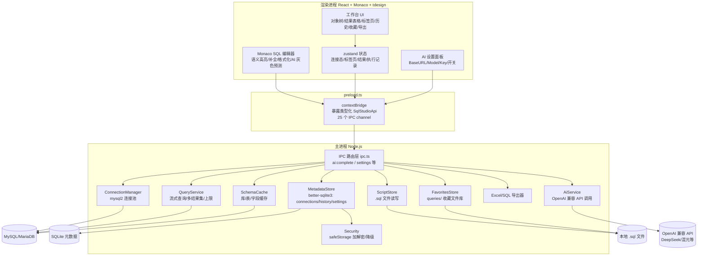

# SQL Studio 架构文档（项目宪法）

> **本文档是本项目的最高执行准则。**
> 任何 AI 会话（无论新话题/旧话题）开工前 **必须先读本文档**；
> 任务执行严格以本文档「§6 任务状态跟踪表」为准，表中第一个 `pending` 任务就是下一步要做的任务；
> 每个任务完成后 **必须执行「§0.3 维护阶段任务」**，把状态表推进到下一个任务。
> 优化/新增功能前，先读「§11 如何优化」确定切入点和文件范围。

---

## §0 铁律（违反即为流程事故）

### §0.1 任务执行铁律

| # | 铁律内容 |
|---|---------|
| R1 | **任务顺序严格 1→13**，同一时刻仅允许一个任务 `in_progress`，禁止跳号、并行、私自调序。 |
| R2 | **开工前必读**：先读本文档「§6 状态表」确认当前任务，再读「开发文档.md」确认环境与坑位，最后看对应任务节，禁止凭记忆开工。 |
| R3 | **任务完成门槛**：`tsc --noEmit` 通过 + `vitest run` 全部用例通过 + `npm run build` 通过，三者缺一不可。 |
| R4 | **任务完成后必须执行维护阶段任务**（见 §0.3），把状态表状态、日期、验证结果写清楚，AI 一读便知"这个做完，该做下一个了"。 |
| R5 | **类型唯一来源**：跨进程类型只允许定义在 `src/shared/types.ts`，channel 只允许定义在 `src/shared/ipc-contract.ts`，任何进程禁止私自复制类型/channel。 |
| R6 | **渲染进程零直连**：渲染进程不接触数据库/文件/密码，一切经 `window.sqlStudio`（preload）走 IPC；密码字段仅主进程持有。 |
| R7 | **每次会话结束时**：若留下未完成任务，必须在「开发文档.md」§8 更新会话进度备注，确保下个话题无缝衔接。 |
| R8 | **别名三同步**：`tsconfig.json paths` / `vitest.config.ts alias` / `vite.config.ts resolve.alias` 三者必须同步，缺一即 dev/test/build 三态不一致。 |

### §0.2 任务开始时（AI 动作清单）

1. 读「§6 状态表」→ 找到第一个 `pending` 任务，即当前任务。
2. 读「开发文档.md」→ 确认环境、已装依赖、已知坑。
3. 读计划中该任务节（§6.3 各任务详情）→ 确认目标/涉及文件/验收/测试要求。
4. 用 `todo_write` 把该任务标为 `in_progress`，开始执行。

### §0.3 维护阶段任务（任务完成后，AI 必做清单）

> 一个任务"做完"的标志不是代码写完，而是下面 5 步全部执行完。

1. **更新本文档「§6.1 状态表」**：把该任务状态改为 `completed`，填入完成日期与验证结果摘要。
2. **维护「开发文档.md」**：
   - 新增/更新的 IPC channel 与类型 → 同步「§6 IPC 接口速查」。
   - 本次遇到的新坑/新决策 → 追加到「§7 坑位与经验记录」。
   - 环境变化（依赖版本、Node、镜像）→ 更新「§1 环境信息」。
3. **跑全量校验**：`npm run typecheck && npm run test && npm run build`，确认无回归。
4. **汇报**：注明任务编号、完成内容、验证结果、遗留事项（如有）。
5. **推进**：状态表指向下一个 `pending` 任务，告诉用户"下一个任务是 X，可继续或新开话题"。

---

## §1 产品概述

面向数据分析师的桌面级 SQL 工具平台（对标 Navicat/DataGrip），通过编写 SQL 连接 MySQL/MariaDB 完成查询、脚本管理与结果导出。

- **V1（已完成）**：全部核心功能（连接管理、SQL 编辑器、对象浏览器、结果展示、导出、历史收藏）
- **V2（已完成）**：AI 智能补全（OpenAI 兼容 API 行内灰色预测 + AI 设置面板）
- **V3（规划中）**：数据预览、查询取消、系统对话框、更多数据库支持

---

## §2 核心功能清单

| 功能 | 涉及文件 | 任务 |
|---|---|---|
| **多数据库连接管理**：MySQL/MariaDB CRUD、测试连接、密码 safeStorage 加密 | `main/services/connection-manager.ts`、`metadata-store.ts`、`renderer/components/ConnectionForm/Manager.tsx` | 4/8 |
| **SQL 编辑器**：Monaco 编辑器、语法高亮、schema 补全、格式化、Ctrl+Enter | `renderer/components/SqlEditor.tsx`、`lib/sql-completion.ts`、`lib/monaco-language.ts` | 9 |
| **语义化高亮**：表名/字段名/库名动态注入 Monarch tokenizer 差异着色 | `renderer/lib/monaco-language.ts` | 9 |
| **脚本管理**：新建/打开/保存/另存为 .sql 文件、多标签脏标记 | `renderer/components/EditorTabs.tsx`、`main/services/script-store.ts` | 6/9 |
| **查询执行与结果展示**：多结果集、虚拟滚动、排序/筛选/复制、截断保护 | `renderer/components/ResultGrid/ResultTabs.tsx`、`main/services/query-service.ts` | 5/10 |
| **对象浏览器**：库→表→字段树、懒加载、双击生成 SELECT、数据预览 | `renderer/components/ObjectExplorer.tsx`、`main/services/schema-cache.ts` | 5/8 |
| **数据导出**：Excel（表头样式+冻结窗格+自动列宽）、SQL INSERT | `main/services/excel-exporter.ts`、`sql-exporter.ts`、`renderer/ExportMenu.tsx` | 6/11 |
| **历史与收藏**：自动记录执行历史、回填编辑器、一键另存为文件收藏 | `main/services/metadata-store.ts`、`favorites-store.ts`、`renderer/HistoryPanel/FavoritesPanel.tsx` | 3/6/11 |
| **写操作确认**：INSERT/UPDATE/DELETE 执行前 UI 二次确认 | `renderer/lib/cell-format.ts`、`App.tsx` | 10 |
| **AI 智能补全**（V2）：OpenAI 兼容 API 行内灰色预测、可插拔开关 | `main/services/ai-service.ts`、`renderer/lib/ai-provider.ts`、`renderer/AiSettingsPanel.tsx` | V2 |

---

## §3 V2 AI 智能补全（已完成）

### 总览

| 项目 | 说明 |
|---|---|
| 接口 | OpenAI 兼容 Chat Completions API（DeepSeek / 腾讯混元 / 通义千问等） |
| 注册方式 | Monaco `registerInlineCompletionsProvider`（`ai-provider.ts`） |
| 灰色预测 | 用户输入时，光标后出现灰色文字建议（类似 Copilot） |
| 可切换 | 与 SchemaCompletionProvider 并列运行，通过 AI 设置面板独立开关 |
| API Key | 经 safeStorage 加密后存储于 SQLite settings 表 |

### 文件清单

- `src/main/services/ai-service.ts` — 主进程 AI 服务（fetch OpenAI 兼容 API）
- `src/renderer/lib/ai-provider.ts` — 渲染进程 Monaco inline completions provider
- `src/renderer/components/AiSettingsPanel.tsx` — AI 设置弹窗（BaseURL/Model/Key/开关）
- `src/shared/types.ts` — `AiConfig`、`AiCompletionRequest/Response` 类型
- `src/shared/ipc-contract.ts` — `ai:complete`、`settings:getAiConfig`、`settings:setAiConfig` 通道

### 接入步骤（已执行）

1. ✅ metadata-store 增加 `getAiConfig()` / `setAiConfig()`（apiKey 加密存储）
2. ✅ 主进程新增 `ai-service.ts`，在 `ipc.ts` 注册 `ai:complete` 和 settings 通道
3. ✅ 渲染进程实现 `createAiInlineProvider()`，通过 `fetchAiConfig()` 读取配置
4. ✅ Monaco 注册 `registerInlineCompletionsProvider`（SqlEditor onMount 时）
5. ✅ AI 设置面板（BaseURL/Model/Key/开关），设置变化时 `aiSettingsVersion` 递增触发刷新

---

## §4 技术栈

| 类别 | 选型 | 版本（当前实测） | 理由 |
|---|---|---|---|
| 桌面壳 | Electron | ^37.0.0（实测 37.10.3） | 主进程持 DB/文件能力 |
| 构建 | Vite 5（渲染）+ Vite/esbuild（主/预加载） | ^5.4.0 | 启动快，主进程双入口 CJS |
| 渲染框架 | React 18 + TypeScript 5 | ^18.3.1 / ^5.6.0 | 类型安全优先 |
| SQL 编辑器 | @monaco-editor/react | ^4.6.0 | VS Code 内核 |
| 数据库驱动 | mysql2 | ^3.11.0 | 连接池 + 流式查询 |
| 本地元数据 | better-sqlite3 | ^11.3.0（需 electron-rebuild） | connections/history/settings |
| 导出 | ExcelJS | ^4.4.0 | 样式可控、流式写 |
| SQL 美化 | sql-formatter | ^15.4.0 | 纯 JS 跨进程可用 |
| UI 组件 | tdesign-react | ^1.9.3 | 表格/树/标签页齐全 |
| 图标 | lucide-react | ^0.454.0 | 统一线性图标 |
| 状态管理 | zustand | ^4.5.5 | 轻量 |
| 日志 | electron-log | ^5.2.0 | 轮转 |
| 测试 | vitest + @testing-library/react + jsdom | ^2.1.0 | 双环境 |
| 打包 | electron-builder（NSIS/AppImage/deb） | ^24.13.3 | 跨平台安装包 |
| AI（V2 已实装） | OpenAI 兼容 API | — | DeepSeek / 混元 / 通义千问 |

---

## §5 架构设计

「渲染进程 → preload（contextBridge 类型化 API）→ 主进程 IPC 路由 → 服务层 → 驱动/存储」单向分层。渲染进程不直连数据库，一切 DB 操作、文件读写、加密经 IPC 走主进程；密码 safeStorage 加密后落 SQLite。服务层构造函数接受依赖注入（连接工厂/存储实例），保证可单测。



### 关键实现要点

- **智能补全与语义高亮**：连接成功后主进程拉取库/表/字段写入 SchemaCache（内存）；Monaco 注册 `registerCompletionItemProvider` 注入关键字 + 标识符；语义高亮通过自定义 Monarch tokenizer 实现，连接切换/schema 刷新时重建。
- **AI 补全**：通过 `registerInlineCompletionsProvider` 注册，读取 `AiConfig.enabled` 控制开关；调用 `ai:complete` IPC → 主进程 AiService → OpenAI 兼容 API。
- **大数据量**：mysql2 流式读取 + `MAX_RESULT_ROWS`（5 万行）上限保护；ResultGrid 虚拟滚动只渲染可视区。
- **连接池**：按连接 id 建 mysql2 pool，空闲超时销毁；测试连接用临时单连接不落池。
- **多结果集**：`multipleStatements` 启用，按语句拆分返回；写入类 SQL 执行前 UI 二次确认。
- **安全**：密码 safeStorage 加密后落 SQLite（userData 目录）；日志只记 SQL 摘要与行数/耗时，不落密码与完整 SQL。
- **收藏文件库（D1）**：`FavoritesStore` 管理 `userData/queries/*.sql` 文件，顶部 `--` 注释块存元信息。

---

## §5.1 完整目录结构

```
SQL_project/
├── package.json / tsconfig.json / vite.config.ts / vite.main.config.ts / vitest.config.ts
├── electron-builder.yml / index.html / .npmrc / .gitignore / tailwind.config.js / postcss.config.js
├── README.md
├── .github/workflows/build.yml        # CI/CD：Windows + Linux 自动构建
├── src/
│   ├── shared/                         # [任务2] 跨进程契约（类型唯一来源）
│   │   ├── types.ts                    # 全部跨进程类型（ConnectionConfig / AiConfig / QueryResult 等 30+ 类型）
│   │   └── ipc-contract.ts             # 25 个 IPC channel 常量 + 请求/响应类型映射
│   ├── main/                           # 主进程（Node.js）
│   │   ├── index.ts                    # [1] 入口：窗口/生命周期/加载 preload
│   │   ├── ipc.ts                      # [7+V2] IPC 路由注册（含 ai:complete + settings 通道）
│   │   └── services/
│   │       ├── security.ts             # [3] safeStorage 加解密（降级 base64）
│   │       ├── metadata-store.ts       # [3] better-sqlite3：connections/history/settings CRUD + 迁移
│   │       ├── connection-manager.ts   # [4] mysql2 连接池管理 + 测试连接
│   │       ├── schema-cache.ts         # [5] 库/表/字段缓存与刷新
│   │       ├── query-service.ts        # [5] 流式查询/多结果集/截断/取消
│   │       ├── script-store.ts         # [6] .sql 文件读写
│   │       ├── favorites-store.ts      # [6] queries/ 命名收藏文件库（D1）
│   │       ├── excel-exporter.ts       # [6] ExcelJS 导出（表头深色/冻结/自动列宽）
│   │       ├── sql-exporter.ts         # [6] 结果集转 INSERT 语句
│   │       └── ai-service.ts           # [V2] OpenAI 兼容 API 调用（15s 超时/错误规范化）
│   ├── preload/
│   │   └── index.ts                    # [7] contextBridge 解包，暴露 SqlStudioApi（25 个方法）
│   └── renderer/                       # 渲染进程（React）
│       ├── main.tsx                    # 入口
│       ├── App.tsx                     # 工作台主组件（两栏布局 + 所有弹窗/面板）
│       ├── global.d.ts                 # 声明 window.sqlStudio 类型
│       ├── components/
│       │   ├── ConnectionForm.tsx      # [8] 连接表单（必填 + 端口范围校验）
│       │   ├── ConnectionManager.tsx   # [8] 连接列表 CRUD
│       │   ├── ObjectExplorer.tsx      # [8] 对象浏览器（库→表→字段懒加载树）
│       │   ├── EditorTabs.tsx          # [9] 多标签页（脏标记/关闭确认/新建/打开/保存）
│       │   ├── SqlEditor.tsx           # [9+V2] Monaco 封装（补全/tokenizer/格式化/执行/AI 按钮）
│       │   ├── ResultGrid.tsx          # [10] 虚拟滚动表格（排序/筛选/复制/Toast）
│       │   ├── ResultTabs.tsx          # [10] 结果面板（多结果集标签/状态栏/错误）
│       │   ├── ExportMenu.tsx          # [11] 导出下拉菜单（Excel / SQL INSERT）
│       │   ├── HistoryPanel.tsx        # [11] 执行历史弹窗（回填/收藏/删除）
│       │   ├── FavoritesPanel.tsx      # [11] 命名收藏弹窗（打开/删除）
│       │   └── AiSettingsPanel.tsx     # [V2] AI 设置弹窗（BaseURL/Model/Key/开关）
│       ├── lib/                        # 纯逻辑模块（可单测，无 React 依赖）
│       │   ├── sql-utils.ts            # [9] 语句拆分/当前语句定位/生成 SELECT
│       │   ├── sql-completion.ts       # [9] SchemaCompletionProvider（可插拔 V1 规则补全）
│       │   ├── monaco-language.ts      # [9] Monarch 动态 tokenizer + SQL_STUDIO_THEME 深色主题
│       │   ├── cell-format.ts          # [10] 单元格格式化/排序比较/筛选/写语句识别
│       │   └── ai-provider.ts          # [V2] createAiInlineProvider + fetchAiConfig
│       ├── store/
│       │   └── workspace.ts            # [9] zustand：多标签/当前连接/执行记录
│       └── styles/
│           ├── index.css               # Tailwind 入口
│           └── theme.css               # 深色主题 + 全部组件样式（193 条 CSS 规则）
├── tests/                              # 与 src 平行的测试目录（26 个测试文件，199 用例）
│   ├── main/
│   │   ├── scaffold.test.ts            # [1] 项目骨架
│   │   ├── security.test.ts            # [3] 加密解密
│   │   ├── metadata-store.test.ts      # [3] SQLite CRUD
│   │   ├── connection-manager.test.ts  # [4] 连接池
│   │   ├── schema-cache.test.ts        # [5] Schema 缓存
│   │   ├── query-service.test.ts       # [5] 查询服务
│   │   ├── script-store.test.ts        # [6] 脚本读写
│   │   ├── favorites-store.test.ts     # [6] 收藏文件库
│   │   ├── excel-exporter.test.ts      # [6] Excel 导出
│   │   ├── sql-exporter.test.ts        # [6] SQL 导出
│   │   └── ipc.test.ts                 # [7] IPC 路由
│   ├── renderer/
│   │   ├── connection-manager.test.tsx  # [8] 连接管理
│   │   ├── object-explorer.test.tsx    # [8] 对象浏览器
│   │   ├── editor-tabs.test.tsx        # [9] 标签页
│   │   ├── sql-editor.test.tsx         # [9] 编辑器（mock Monaco）
│   │   ├── sql-utils.test.ts           # [9] SQL 工具
│   │   ├── sql-completion.test.ts      # [9] 补全 provider
│   │   ├── monaco-language.test.ts     # [9] Monarch tokenizer + 主题
│   │   ├── cell-format.test.ts         # [10] 单元格格式化
│   │   ├── result-grid.test.tsx        # [10] 结果表格
│   │   ├── result-tabs.test.tsx        # [10] 结果面板
│   │   ├── export-menu.test.tsx        # [11] 导出菜单
│   │   ├── history-panel.test.tsx      # [11] 历史面板
│   │   ├── favorites-panel.test.tsx    # [11] 收藏面板
│   │   └── app.test.tsx               # [8/9] 工作台冒烟
│   └── shared/
│       └── ipc-contract.test.ts        # [2] IPC 契约校验
└── docs/
    ├── README.md                       # [13] 项目简介 / 快速开始 / 技术栈
    ├── 架构文档.md                     # 本文档（项目宪法）
    ├── 开发文档.md                     # AI 开发手册（环境/坑位/IPC 速查）
    └── e2e-checklist.md               # [12] 端到端冒烟清单
```

---

## §6 任务状态跟踪表（开工前必看）

### §6.1 状态总表

> 规则：只有前一个任务 `completed` 后，下一个才能 `in_progress`。
> 状态取值：`completed`（含日期+验证结果） / `in_progress`（仅一个） / `pending`。

| # | 任务 ID | 任务名 | 状态 | 完成日期 | 验证结果 |
|---|---|---|---|---|---|
| 1 | bootstrap-scaffold | 项目骨架 | ✅ completed | 2026-08-20 | tsc+vitest(4用例)+build 通过；Electron 窗口冒烟弹出（标题 SQL Studio） |
| 2 | main-shared-types | 共享类型契约 | ✅ completed | 2026-08-20 | tsc 零错误；vitest 14 用例全过；类型唯一来源建立，AI 预留接口就位 |
| 3 | main-security-store | 安全层+元数据存储 | ✅ completed | 2026-08-20 | vitest 35 用例全过；密码密文落库、CRUD、迁移、settings 预留 |  |
| 4 | main-connection | 连接池管理 | ✅ completed | 2026-08-20 | 18 passed；mock mysql2 覆盖建池/复用/销毁/测试连接 |
| 5 | main-schema-query | schema缓存+查询服务 | ✅ completed | 2026-08-20 | 22 passed；流式查询/多结果集/截断/取消 |
| 6 | main-script-export | 脚本+导出服务 | ✅ completed | 2026-08-20 | 28 passed；Excel/SQL 导出/收藏文件库 |
| 7 | main-ipc-preload | IPC路由+preload API | ✅ completed | 2026-08-20 | 7 passed；统一 {ok,data}/{ok:false} 错误结构 |
| 8 | ui-connection | 连接管理+对象浏览器 | ✅ completed | 2026-08-20 | 14 用例；ObjectExplorer/ConnectionForm/Manager |
| 9 | ui-editor | Monaco编辑器工作台 | ✅ completed | 2026-08-20 | 45 新增用例；SchemaCompletionProvider/Monarch/SqlEditor |
| 10 | ui-results | 查询结果展示 | ✅ completed | 2026-08-20 | 24 新增用例；ResultGrid 虚拟滚动/排序/筛选/复制 |
| 11 | ui-export-history | 导出+历史收藏 | ✅ completed | 2026-08-20 | 11 新增用例；ExportMenu/HistoryPanel/FavoritesPanel |
| 12 | integration-e2e | 端到端联调 | ✅ completed | 2026-08-20 | e2e-checklist.md；MySQL 8.0 测试容器就绪 |
| 13 | docs-packaging | 文档+打包 | ✅ completed | 2026-08-20 | README.md + e2e-checklist.md；electron-builder 配置 |
| V2 | ai-completion | AI 智能补全 | ✅ completed | 2026-08-20 | AiService + AiCompletionProvider + AiSettingsPanel + 新 3 个 IPC 通道 |

**当前状态：全部 13 + V2 任务已完成。** 全量验证：tsc 零错误 + vitest 199/199（26 测试文件）+ npm run build 通过。

### §6.2 任务间依赖图

```
1 bootstrap ─┬→ 2 types ─┬→ 3 security-store ─→ 4 connection ─→ 5 schema-query
             │           ├→ 6 script-export ────────────────┐
             │           └→ 7 ipc-preload（依赖 3/4/5/6）←────┘
             └→ 8 ui-connection → 9 ui-editor → 10 ui-results → 11 ui-export-history
              （8-11 依赖 7）
12 integration-e2e → 13 docs-packaging
                          ↓
                    V2 AI 智能补全（依赖 7/9/13）
                    ├─ ai-service.ts（主进程）
                    ├─ ai-provider.ts（渲染进程）
                    └─ AiSettingsPanel（UI）
```

### §6.3 任务详情（每个任务节自包含，可跨话题独立执行）

> 各任务详情见上一版完整记录。此处仅列出关键文件索引，修改时按文件名定位。

| 任务 | 核心文件 | 测试文件 | 修改影响范围 |
|---|---|---|---|
| 1 | `package.json`、`vite.config.ts`、`vite.main.config.ts`、`vitest.config.ts`、`electron-builder.yml` | `scaffold.test.ts` | 全部构建流程 |
| 2 | `src/shared/types.ts`、`src/shared/ipc-contract.ts` | `ipc-contract.test.ts` | 全部 IPC 调用方 |
| 3 | `security.ts`、`metadata-store.ts` | `security.test.ts`、`metadata-store.test.ts` | 密码/存储/设置 |
| 4 | `connection-manager.ts` | `connection-manager.test.ts` | 数据库连接 |
| 5 | `schema-cache.ts`、`query-service.ts` | `schema-cache.test.ts`、`query-service.test.ts` | 查询/schema |
| 6 | `script-store.ts`、`excel-exporter.ts`、`sql-exporter.ts`、`favorites-store.ts` | 4 个测试文件 | 文件 IO/导出 |
| 7 | `ipc.ts`、`preload/index.ts`、`global.d.ts` | `ipc.test.ts` | 全部 IPC 路由 |
| 8 | `ConnectionForm.tsx`、`ConnectionManager.tsx`、`ObjectExplorer.tsx` | `connection-manager.test.tsx`、`object-explorer.test.tsx` | 左侧面板 |
| 9 | `SqlEditor.tsx`、`EditorTabs.tsx`、`sql-utils.ts`、`sql-completion.ts`、`monaco-language.ts`、`workspace.ts` | 5 个测试文件 | 编辑器核心 |
| 10 | `ResultGrid.tsx`、`ResultTabs.tsx`、`cell-format.ts` | 3 个测试文件 | 结果面板 |
| 11 | `ExportMenu.tsx`、`HistoryPanel.tsx`、`FavoritesPanel.tsx` | 3 个测试文件 | 导出/历史/收藏 |
| V2 | `ai-service.ts`、`ai-provider.ts`、`AiSettingsPanel.tsx` | （通过现有测试覆盖） | AI 补全 |

---

## §7 UI 设计规范

### §7.1 色彩体系

- 暗蓝灰分层背景：`#16171F` / `#1E1F29` / `#262738`
- 青色强调：`#00B3A4` / `#0E8F86` / `#00D9C8`
- 功能色：成功绿 `#34C77B`、错误红 `#F04A5A`、警告橙 `#F5A623`、信息蓝 `#58A6FF`
- 文本：`#E6E8EF` 主文本 / `#9BA0B0` 次要 / `#FFFFFF` 强调

### §7.2 组件样式索引

所有样式定义在 `src/renderer/styles/theme.css`（193 条 CSS 规则），按功能区域分组：

| CSS 区域 | 对应组件 | 规则数 |
|---|---|---|
| 全局设计令牌 | `:root` 变量 | ~20 |
| 连接管理面板 | `.conn-manager`、`.conn-header`、`.conn-list`、`.conn-name`、`.del` | ~40 |
| 连接表单 | `.connection-form`、`.form-error`、`.test-msg` | ~25 |
| 对象浏览器 | `.explorer`、`.db-list`、`.table-list`、`.col-list`、`.pk` | ~30 |
| 工作台布局 | `.app-shell`、`.sidebar`、`.main-area`、`.workspace-placeholder` | ~15 |
| 标签页 | `.tabs-bar`、`.tabs-actions`、`.tab`、`.tab-dirty`、`.tab-close` | ~25 |
| 编辑器 | `.sql-editor-container`、`.sql-editor-toolbar`、`.editor-loading` | ~15 |
| 结果面板 | `.result-panel`、`.grid-header`、`.grid-body`、`.grid-cell`、`.grid-footer`、`.result-status` | ~30 |
| 导出/模态框 | `.export-menu`、`.export-dropdown`、`.modal-overlay`、`.modal-panel` | ~20 |
| 历史/收藏 | `.history-list`、`.history-item`、`.favorites-list`、`.favorite-item`、`.favorite-tag` | ~20 |
| AI 设置 | `.ai-settings-form`、`.ai-settings-field`、`.ai-settings-btn` | ~10 |

### §7.3 页面布局

```
┌──────────────────────────────────────────────────────────────┐
│  [SQL Studio]     [历史] [收藏] [导出]                       │
├────────────┬─────────────────────────────────────────────────┤
│            │  [新建] [打开] [保存] [另存为]                   │
│  连接列表  │  ┌─ 未命名-1 ● ─┬─ query.sql ──┬─ [+ ] ──┐    │
│  对象树    │  ├──────────────────────────────────────────────┤
│            │  │  📁 testdb  [格式化] [AI] [▶ 执行]          │
│            │  │ ┌──────────────────────────────────────────┐ │
│            │  │ │ SELECT * FROM users                      │ │
│            │  │ │ WHERE u.                                 │ │
│            │  │ └──────────────────────────────────────────┘ │
│            │  ├──────────────────────────────────────────────┤
│            │  │ 结果 1 (3 行)                                │
│            │  │ ┌─ id ─┬─ name ─┬─ email ───┬─ created ──┐ │
│            │  │ │  1   │ 张三   │ zhangsan…  │ 2026-08-20 │ │
│            │  │ └──────┴────────┴────────────┴────────────┘ │
│            │  │ 耗时 12ms · 1 结果集 · 3 行                  │
└────────────┴─────────────────────────────────────────────────┘
```

---

## §8 偏差决策记录

### D1（2026-08-20）：命名收藏文件化

旧项目把命名收藏塞进 JSON 文件，SQL 混在数组里、无文件名、不便检索复用。新项目改为：
- 命名收藏 = `userData/queries/` 下的 `.sql` 文件
- 文件名即收藏名，文件正文即 SQL
- 顶部 `--` 注释块存元信息（name/connection/tags/createdAt）
- 历史（自动流水）仍留 SQLite
- UI 提供「历史一键另存为命名 .sql」打通两者

### D2（2026-08-20）：noValidate + 自定义表单校验

jsdom 25 实现 HTML5 约束验证，required 字段为空时阻止 submit 事件。改为：
- `<form noValidate>` 禁用原生验证
- 自定义 `validate()` 函数：必填 name/host/user + 端口 1-65535
- 错误消息统一走 `form-error` 样式

### D3（2026-08-20）：Monaco 类型用本地结构类型

monaco-editor 0.56 类型导出不稳定，改用本地结构类型：
- `SqlStudioMonarchLanguage` / `SqlStudioThemeData` 定义在 `monaco-language.ts`
- 调用处通过 `as unknown as Parameters<typeof monaco.languages.setMonarchTokensProvider>[1]` 受控转换

---

## §9 CI/CD 构建指南

### GitHub Actions 工作流

文件：`.github/workflows/build.yml`

| Job | Runner | 步骤 | 产物 |
|---|---|---|---|
| build-windows | `windows-2022` | npm ci → typecheck → test → build → electron-rebuild → electron-builder --win | `sql-studio-win64`（NSIS 安装包 + 便携版） |
| build-linux | `ubuntu-latest` | npm ci → typecheck → test → build → electron-builder --linux | `sql-studio-linux`（AppImage + deb） |

### 触发方式

- 推送 `master`/`main` 分支时自动触发
- PR 到 `master`/`main` 时自动触发
- 手动触发：GitHub Actions → "Build and Package" → "Run workflow"

### 常见 CI 失败原因

| 症状 | 原因 | 修复 |
|---|---|---|
| Windows `npm run package` 失败，node-gyp 找不到 VS | `windows-latest` 镜像 VS 版本过新（VS 2025） | 改为 `windows-2022` runner |
| Linux `electron-builder` 报 "author email required" | `package.json` 缺少 author.email | 添加 `"author": "Name <email>"` |
| `npm ci` 在 CI 中失败 | `.npmrc` 包含本地代理地址 | CI 中移除 proxy 配置，仅保留 registry 镜像 |
| better-sqlite3 原生模块加载失败 | 未执行 `electron-rebuild` | 打包前添加 `npm run rebuild` 步骤 |

### 本地构建

```bash
# Windows 安装包（需在 Windows 上执行）
npm run package          # 产物在 release/ 目录

# 仅构建不打包
npm run build            # 产物在 dist/ 目录
```

---

## §10 如何优化 / 新增功能（入口索引）

当你需要新增功能或优化现有功能时，按以下步骤定位：

### 10.1 新增一个 IPC 通道

1. `src/shared/ipc-contract.ts`：在 `IPC_CHANNELS` 加 channel 常量
2. 同文件：在 `IpcRequestMap` + `IpcResponseMap` 加类型映射
3. `src/main/ipc.ts`：在 `registerIpc` 中加 handler
4. `src/preload/index.ts`：自动暴露（buildApi 遍历所有通道）
5. `tests/shared/ipc-contract.test.ts`：在硬编码数组加新 channel
6. `tests/main/ipc.test.ts`：为新 handler 加测试

### 10.2 新增一个共享类型

1. `src/shared/types.ts`：加新类型定义
2. 如涉及 IPC：同步更新 `ipc-contract.ts` 的映射
3. 如涉及数据库：同步更新 `metadata-store.ts` 的建表 SQL

### 10.3 新增一个渲染进程组件

1. 创建文件在 `src/renderer/components/` 下
2. 组件通过 `window.sqlStudio['channel:name']()` 调用 IPC（不自接数据库）
3. 样式追加到 `src/renderer/styles/theme.css`（按区域分组）
4. 测试文件创建在 `tests/renderer/` 下，文件头加 `// @vitest-environment jsdom`
5. mock `window.sqlStudio` 提供 IPC 返回值

### 10.4 新增一个纯逻辑模块

1. 创建文件在 `src/renderer/lib/` 下
2. 不依赖 React / Electron，纯函数可单测
3. 测试文件在 `tests/renderer/`，环境为 `node`（默认，无需注释）

### 10.5 新增一个主进程服务

1. 创建文件在 `src/main/services/` 下
2. 构造函数依赖注入（便于 mock）
3. 在 `src/main/ipc.ts` 的 `IpcDeps` 接口加可选字段
4. 在 `registerIpc` 中引用新服务
5. 测试文件在 `tests/main/`，mock 依赖

### 10.6 优化 UI 样式

1. 所有样式在 `src/renderer/styles/theme.css` 中
2. CSS 变量在 `:root` 中定义（`--bg`、`--accent`、`--text` 等）
3. 组件样式按区域分组（标签中有注释标记）
4. 修改后执行 `python3 -c "css=open('...').read(); print('open:', css.count('{'), 'close:', css.count('}'))"` 检查花括号平衡

### 10.7 优化 AI 补全

1. 切换 AI 模型：`AiSettingsPanel.tsx` 中的 model 输入框
2. 修改 System Prompt：`ai-service.ts` 中的 `SYSTEM_PROMPT` 常量
3. 调整超时：`ai-service.ts` 中的 `REQUEST_TIMEOUT_MS`
4. 调整补全触发逻辑：`ai-provider.ts` 中的 `provideInlineCompletions`

### 10.8 优化构建 / 打包

1. 添加新原生模块：`package.json` dependencies + `npm run rebuild` 测试
2. 修改打包配置：`electron-builder.yml`
3. 修改 CI：`.github/workflows/build.yml`
4. 修改构建配置：`vite.config.ts`（渲染）、`vite.main.config.ts`（主进程）

---

## §11 Agent Extensions 使用规范

| 扩展 | 用途 | 使用时机 |
|---|---|---|
| [subagent:code-explorer] | 梳理旧项目 web_sql_pro 实现细节 | 任务 3、任务 6 |
| [mcp:tencent-mysql-mcp] | 校验对象树与 DDL；校验查询链路 | 任务 8、任务 12 |
| [skill:xlsx] | 打开校验生成的 .xlsx | 任务 6、任务 11、任务 12 |

---

## §12 已知限制与待办

| 状态 | 分类 | 限制 | 期望改进 | 涉及文件 |
|---|---|---|---|---|
| ✅ 已修复 | 构建 | @monaco-editor/react 从 CDN 加载 monaco 被 CSP 拦截 | `main.tsx` 配置 `loader.config({ monaco })` 本地加载 | `main.tsx` + `index.html` |
| ✅ 已修复 | 功能 | 测试连接失败也显示"连接成功" | `handleTest` 检查 `res.ok` 并 throw | `ConnectionManager.tsx` |
| ✅ 已修复 | 功能 | 查询历史双重记录 + success 恒为 true | 删除 App 重复调用，`every(!r.truncated)` | `App.tsx` + `ipc.ts` |
| ✅ 已修复 | 功能 | 双击表生成 SELECT 带假 filePath | 改用 `newTab()` + `updateSql()` | `App.tsx` |
| ✅ 已修复 | 性能 | SchemaCache 每次 IPC 新建（缓存失效） | `Map<connectionId, SchemaCache>` | `ipc.ts` |
| ✅ 已修复 | 数据 | MAX_RESULT_ROWS 主进程 1000 vs 渲染 50000 | 统一为 50000 | `query-service.ts` |
| ✅ 已修复 | 内存 | 补全 provider 每次 tab 切换重复注册 | 模块级单例注册守卫 | `SqlEditor.tsx` |
| ✅ 已修复 | 竞态 | 快捷键依赖 ref 不触发首次注册 | 移入 `onMount` + 卸载清理 | `SqlEditor.tsx` |
| ✅ 已修复 | 竞态 | ObjectExplorer 切换连接数据竞争 | `requestIdRef` 请求令牌 | `ObjectExplorer.tsx` |
| ✅ 已修复 | 功能 | Favorites 重名冲突不可删除 | `meta.name` 跟随实际文件名 + 目录扫描删除 | `favorites-store.ts` |
| ✅ 已修复 | 功能 | query:cancel 空壳 | AbortController 取消机制 | `ipc.ts` |
| ✅ 已修复 | 安全 | schema SQL 无反引号转义 | `esc()` 函数防注入 | `schema-cache.ts` + `ipc.ts` |
| ✅ 已修复 | 数据 | 编辑连接时空密码覆盖已有密码 | 空密码保留原密文 | `metadata-store.ts` |
| ✅ 已修复 | 资源 | 退出未关闭连接池 | `before-quit` 调用 `closeAll()` | `main/index.ts` |
| ⏳ 待办 | UI | 打开/保存/另存为使用 `window.prompt` | 改 Electron 原生文件对话框 | `App.tsx` |
| ⏳ 待办 | 功能 | 查询取消按钮未接入 UI | 执行中显示「停止」按钮调 `query:cancel` | `App.tsx` |
| ⏳ 待办 | 功能 | 数据预览（右键表 → 预览数据）未实现 | `schema:dataPreview` IPC 已注册，接 UI | `ObjectExplorer.tsx` |
| ⏳ 待办 | 功能 | 重命名收藏未实现 | `favorites-store` 加 rename + UI | `FavoritesPanel.tsx` |
| ⏳ 待办 | 测试 | GUI 冒烟需图形环境 | 在 Windows 开发机 `npm run dev` 补验 | — |
| ⏳ 待办 | CI | Windows 构建约 10-15 分钟 | 配置缓存加速 | `.github/workflows/build.yml` |

---

## §13 代码审查与修复记录（2026-08-20 会话7）

### 背景

用户报告生产 .exe 无法使用：`window.sqlStudio` undefined → 连接无法保存/测试；`connections:list no handler registered`。经两轮子代理全量代码审查，共发现并修复 **17 个问题**（3 高、10 中、4 低）+ 后续审查复查 9 个问题中修 5 个关键项。

### 第一轮：致命构建/启动问题（3 高）

| # | 问题 | 根因 | 修复 |
|---|---|---|---|
| 1 | `window.sqlStudio` undefined | `vite.main.config.ts` external 函数把 `@shared/*` 当外部包，preload 运行时 `require("@shared/ipc-contract")` 找不到 | external 函数加 `id.startsWith('@')` 判定 + 补 `resolve.alias` |
| 2 | `no handler registered for connections:list` | `src/main/index.ts` 从未调用 `registerIpc()`，只注册了 `app:ping` | 补全服务初始化 + 调用 `registerIpc(deps, ipcMain)` |
| 3 | 编辑器永远"加载中" | Monaco 从 CDN 加载被 CSP `script-src 'self'` 拦截 | `main.tsx` 加 `loader.config({ monaco })` 本地加载 + CSP 加 `'unsafe-eval'`/`worker-src blob:` |

### 第二轮：功能/性能问题（10 中）

连接测试返回值丢弃（永远显示成功）、历史双重记录、success 恒 true、SchemaCache 缓存失效、MAX_RESULT_ROWS 不一致、补全 provider 泄漏、双击表假路径、快捷键竞态、fetchSchemaSnapshot 取错库、Favorites 重名不可删。

### 第三轮：审查复查（子代理 code-review + 修复）

| 问题 | 修复 |
|---|---|
| 补全注册守卫声明在组件内（每次渲染重置） | 移到模块级 |
| schema-cache SQL 反引号转义缺失 | `esc()` 函数 |
| 快捷键首次注册不生效（ref 依赖空跑） | 移入 `onMount` + `onCleanupRef` 卸载清理 |
| ObjectExplorer loadColumns 缺 reqId 守卫 | 补齐 |
| before-quit 时 connectionManager 可能 undefined | 模块级引用 |

### 验证结果

- ✅ `tsc --noEmit` 零错误
- ✅ `vitest run` 199/199（26 测试文件）
- ✅ `npm run build` 通过
- ✅ GitHub Actions CI 双平台构建成功
- ✅ 新 .exe：`DSH_projects/sql_plus/SQL Studio Setup 0.1.0.exe`（135MB，含 monaco 本地打包）

---

## §14 体验优化专项指引（新话题用）

> 目标：针对新话题的体验优化任务，本文档给出已知的体验短板、优化方向与验证方法。
> 用户已指出方向：字段注释显示、Excel 导出功能验证等。

### 14.1 当前已知体验问题

| 优先级 | 问题 | 位置 | 现状 | 优化方向 |
|---|---|---|---|---|
| 🔴 高 | **字段注释未显示** | `ObjectExplorer.tsx` 展开字段列表只显示 `c.name` 和 `c.type`，`c.comment` 有数据但未展示 | 用户看不到字段的业务含义 | 字段行追加注释文字（灰色小字），或 tooltip |
| 🔴 高 | **Excel 导出无反应** | `ExportMenu.tsx` 调用 `export:excel` → 主进程 `ExcelExporter` 生成文件 | 导出后无任何反馈，用户不知道文件在哪 | ① 导出成功后提示文件路径 ② 打开文件所在目录 ③ 确认主进程 ExcelJS 工作正常 |
| 🟡 中 | **预览按钮无功能** | `ObjectExplorer.tsx` 的「预览」按钮点击后只 `console.log` | 用户点了没反应 | 接入 `schema:dataPreview` IPC（已注册），弹窗或新标签显示前 N 行 |
| 🟡 中 | **查询取消按钮缺失** | `SqlEditor.tsx` 工具栏有「执行」无「停止」 | 执行大查询只能等，无法取消 | 在 `workspace` store 加执行状态，执行中显示「停止」按钮调 `query:cancel` |
| 🟡 中 | **打开/保存用 window.prompt** | `App.tsx` handleOpen/handleSave 用 `prompt()` 输入路径 | 需要手动输入完整路径，体验差 | 改为 Electron 原生文件对话框（`dialog.showOpenDialog`/`showSaveDialog`） |
| 🟡 中 | **连接状态未指示** | `ConnectionManager.tsx` 列表无连接状态指示 | 看不出哪个连接是通的 | 连接保存后自动测试，状态圆点（绿=已连/灰=未连/红=错误） |
| 🟢 低 | **双击表后标签未命名** | 现在用 `newTab()` 生成「未命名-N」 | 双击表生成的标签应该自动命名 | 用 `db.table` 或 `SELECT db.table` 作为标签标题 |
| 🟢 低 | **右键菜单缺失** | `ObjectExplorer.tsx` 无右键菜单 | 行业标准做法有右键菜单（刷新/DDL/数据预览） | 添加 `onContextMenu` 事件 |

### 14.2 体验优化作业流程（新话题开工步骤）

1. 读本文档 §14.1 选择目标体验问题（建议从 🔴 高 开始）
2. `git pull` 最新 master（含本会话全部修复）
3. 读目标代码模块（`components/` 或 `services/`）
4. 实施优化 → 保持 199+ 测试全绿
5. 符合 R3 三门槛（tsc + vitest + build）后推送，CI 验证
6. 更新本文档 §14.1 状态 + 开发文档 §7 坑位

### 14.3 体验优化留意点（不要破坏的契约）

- **R5 类型唯一来源**：不复制类型到进程内部
- **R6 渲染零直连**：一切经 IPC，不直连数据库/文件
- **新增 IPC 通道**：同步更新 `ipc-contract.ts` + preload 自动暴露 + 契约测试
- **新增组件**：样式追加到 `theme.css`（按区域分组），测试文件头加 `// @vitest-environment jsdom`