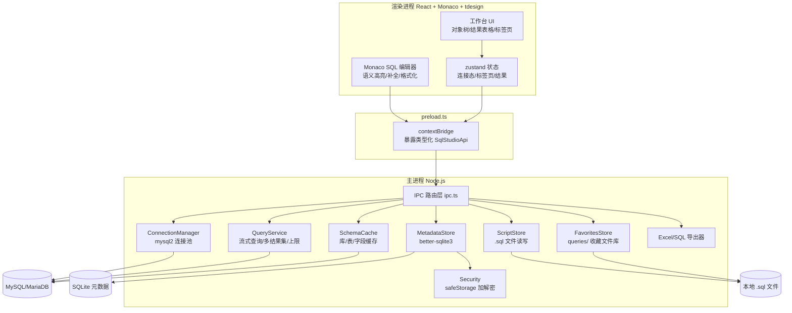

# SQL Studio 架构文档（项目宪法）

> **本文档是本项目的最高执行准则。**
> 任何 AI 会话（无论新话题/旧话题）开工前 **必须先读本文档**；
> 任务执行严格以本文档「§6 任务状态跟踪表」为准，表中第一个 `pending` 任务就是下一步要做的任务；
> 每个任务完成后 **必须执行「§0.3 维护阶段任务」**，把状态表推进到下一个任务。

---

## §0 铁律（违反即为流程事故）

### §0.1 任务执行铁律

| # | 铁律内容 |
|---|---------|
| R1 | **任务顺序严格 1→13**，同一时刻仅允许一个任务 `in_progress`，禁止跳号、并行、私自调序。 |
| R2 | **开工前必读**：先读本文档「§6 状态表」确认当前任务，再读「开发文档.md」确认环境与坑位，最后看对应任务节，禁止凭记忆开工。 |
| R3 | **任务完成门槛**：`tsc --noEmit` 通过 + `vitest run` 相关用例通过 + 冒烟验收（能跑的都跑），三者缺一不可。 |
| R4 | **任务完成后必须执行维护阶段任务**（见 §0.3），把状态表状态、日期、验证结果写清楚，AI 一读便知"这个做完，该做下一个了"。 |
| R5 | **类型唯一来源**：跨进程类型只允许定义在 `src/shared/types.ts`，channel 只允许定义在 `src/shared/ipc-contract.ts`，任何进程禁止私自复制类型/channel。 |
| R6 | **渲染进程零直连**：渲染进程不接触数据库/文件/密码，一切经 `window.sqlStudio`（preload）走 IPC；密码字段仅主进程持有。 |
| R7 | **每次会话结束时**：若留下未完成任务，必须在「开发文档.md」§8 更新会话进度备注，确保下个话题无缝衔接。 |

### §0.2 任务开始时（AI 动作清单）

1. 读「§6 状态表」→ 找到第一个 `pending` 任务，即当前任务。
2. 读「开发文档.md」→ 确认 Node 路径、代理、已装依赖、已知坑。
3. 读计划中该任务节（§6.3 各任务详情）→ 确认目标/涉及文件/验收/测试要求。
4. 用 `todo_write` 把该任务标为 `in_progress`，开始执行。

### §0.3 维护阶段任务（任务完成后，AI 必做清单）

> 一个任务"做完"的标志不是代码写完，而是下面 5 步全部执行完。

1. **更新本文档「§6.1 状态表」**：把该任务状态改为 `completed`，填入完成日期与验证结果摘要（如 "tsc+vitest+冒烟 通过，Electron v37.10.3"）。
2. **维护「开发文档.md」**：
   - 新增/更新的 IPC channel 与类型 → 同步「§6 IPC 接口速查」。
   - 本次遇到的新坑/新决策 → 追加到「§7 坑位与经验记录」。
   - 环境变化（依赖版本、Node、镜像）→ 更新「§1 环境信息」。
3. **跑全量校验**：`npm run typecheck && npm run test && npm run build`，确认无回归。
4. **汇报**：注明任务编号、完成内容、验证结果、遗留事项（如有）。
5. **推进**：状态表指向下一个 `pending` 任务，告诉用户"下一个任务是 X，可继续或新开话题"。

---

## §1 产品概述

面向数据分析师的桌面级 SQL 工具平台（对标 Navicat/DataGrip），通过编写 SQL 连接 MySQL/MariaDB 完成查询、脚本管理与结果导出，作为可持续维护的项目替代原 `web_sql_pro`（该目录保留不动，仅作功能参考）。

## §2 核心功能清单

- **多数据库连接管理**：配置多个 MySQL/MariaDB 连接（主机/端口/用户/密码/默认库/字符集），支持增删改查、测试连接、连接状态指示，密码本地加密存储（safeStorage）。
- **SQL 编辑器**：基于 Monaco，语法高亮、智能补全（关键字 + 已连接库的表名/字段名/库名）、SQL 格式化、选区执行与 Ctrl+Enter 执行、多标签页。
- **表名/字段名语义化高亮**：已连接库的表名/字段名/库名通过实时 schema 动态注入，与关键字、普通标识符使用不同颜色区分。
- **脚本管理**：新建/打开/保存/另存为 .sql 脚本文件，文件系统持久化，标签页未保存状态标记。
- **查询执行与结果展示**：一次执行多条语句返回多结果集；结果表格排序、按列筛选、双击复制；大数据量行数上限保护；展示执行耗时与影响行数。
- **对象浏览器**：连接 → 数据库 → 表 → 字段树形浏览，查看表结构 DDL 与数据预览，双击表自动生成 SELECT。
- **数据导出**：导出 Excel（全量/当前筛选结果）；将结果集导出为 SQL INSERT 语句。
- **历史与收藏**：SQL 执行历史（一键回填编辑器）、命名收藏常用 SQL，本地持久化。

## §3 AI 智能补全（V2 迭代，本次架构预留）

- **本次范围**：AI 不做实装。编辑器补全仅基于 schema 规则（关键字 + 库/表/字段名）。
- **V2 目标**：接入 DeepSeek / 腾讯混元等 OpenAI 兼容 API，在 Monaco 中实现「AI 智能补全建议」（灰色行内预测，类似 Copilot）。
- **架构预留（本次必须做）**：
  - 补全 provider 采用**可插拔接口**设计：`CompletionProvider` 抽象出统一方法，V1 实现为 `SchemaCompletionProvider`（规则补全），V2 新增 `AiCompletionProvider` 并列注册/可切换，不影响已有规则补全。
  - 渲染进程新增 `AiProvider` 类型定义与 IPC channel 占位（`ai.complete`），V2 实装时复用，避免破坏性改动。
  - AI Key 与配置项在 V2 接入时经 safeStorage 加密存储于 SQLite settings 表，本次只在 metadata-store 预留 settings 表结构。
  - 文档：「开发文档.md」§9「AI 扩展指南」说明 V2 接入点与步骤。

## §4 技术栈

| 类别 | 选型 | 版本（当前实测） | 理由 |
| --- | --- | --- | --- |
| 桌面壳 | Electron | ^37.0.0（实测 37.10.3） | 主进程持 DB/文件能力 |
| 构建 | Vite 5（渲染）+ Vite/esbuild（主/预加载） | ^5.4.0 | 启动快，主进程双入口 CJS |
| 渲染框架 | React 18 + TypeScript 5 | ^18.3.1 / ^5.6.0 | 类型安全优先 |
| SQL 编辑器 | @monaco-editor/react | ^4.6.0 | VS Code 内核 |
| 数据库驱动 | mysql2 | ^3.11.0 | 连接池 + 流式查询 |
| 本地元数据 | better-sqlite3 | ^11.3.0（需 electron-rebuild） | connections/history/favorites |
| 导出 | ExcelJS | ^4.4.0 | 样式可控、流式写 |
| SQL 美化 | sql-formatter | ^15.4.0 | 纯 JS 跨进程可用 |
| UI 组件 | tdesign-react | ^1.9.3 | 表格/树/标签页齐全 |
| 图标 | lucide-react | ^0.454.0 | 统一线性图标 |
| 状态管理 | zustand | ^4.5.5 | 轻量 |
| 日志 | electron-log | ^5.2.0 | 轮转 |
| 测试 | vitest + @testing-library/react + jsdom | ^2.1.0 | 双环境 |
| 打包 | electron-builder（NSIS） | ^24.13.3 | Windows 安装包 |
| AI（V2 预留） | OpenAI 兼容 API | — | V1 不实装 |

## §5 架构设计

「渲染进程 → preload（contextBridge 类型化 API）→ 主进程 IPC 路由 → 服务层 → 驱动/存储」单向分层。渲染进程不直连数据库，一切 DB 操作、文件读写、加密经 IPC 走主进程；密码 safeStorage 加密后落 SQLite。服务层构造函数接受依赖注入（连接工厂/存储实例），保证可单测。



> **收藏存储分工（偏差决策 D1）**：`MetadataStore` 仅管 connections/history 两张 SQLite 表；**命名收藏改为 `FavoritesStore` 管理 `userData/queries/` 文件夹下的 `.sql` 文件**（见 §8 偏差决策 D1），与 `ScriptStore` 同走文件系统（FS），不在 SQLite 内。

### 关键实现要点

- **智能补全与语义高亮**：连接成功后主进程拉取库/表/字段写入 SchemaCache（内存）；Monaco 注册 `registerCompletionItemProvider` 注入关键字 + 标识符；语义高亮通过自定义 Monarch tokenizer（继承 SQL 语法 + 动态注入标识符表）实现，连接切换/schema 刷新时重建。补全 provider 为可插拔接口 `CompletionProvider`。
- **大数据量**：mysql2 流式读取 + `MAX_RESULT_ROWS`（5 万行）上限保护；结果表格虚拟滚动只渲染可视区；导出全量在主进程重新流式查询。
- **连接池**：按连接 id 建 mysql2 pool，空闲超时销毁；测试连接用临时单连接不落池。
- **多结果集**：`multipleStatements` 启用，按语句拆分返回；写入类 SQL 执行前 UI 二次确认。
- **安全**：密码 safeStorage 加密后落 SQLite（userData 目录）；日志只记 SQL 摘要与行数/耗时，不落密码与完整 SQL。
- **脚本持久化**：标签页 `{id, filePath?, sql, isDirty}`，打开/保存走系统对话框（.sql 过滤器），关闭未保存标签二次确认。

## §5.1 目录结构

```
SQL_project/
├── package.json / tsconfig.json / vite.config.ts / vite.main.config.ts / vitest.config.ts
├── electron-builder.yml / index.html / tailwind.config.js / postcss.config.js / .npmrc
├── src/
│   ├── shared/
│   │   ├── types.ts          # [任务2] 跨进程共享类型（唯一来源）
│   │   └── ipc-contract.ts   # [任务2] IPC channel 常量与请求/响应类型（唯一来源）
│   ├── main/
│   │   ├── index.ts          # [完成] 入口：窗口/生命周期/加载 preload
│   │   ├── ipc.ts            # [任务7] IPC 路由注册（依赖注入服务实例）
│   │   └── services/
│   │       ├── security.ts           # [任务3] safeStorage 加解密（降级方案）
│   │       ├── metadata-store.ts     # [任务3] better-sqlite3 CRUD + 迁移
│   │       ├── connection-manager.ts # [任务4] mysql2 连接池管理
│   │       ├── schema-cache.ts       # [任务5] 库/表/字段缓存与刷新
│   │       ├── query-service.ts      # [任务5] 流式查询/多结果集/取消
│   │       ├── script-store.ts       # [任务6] .sql 文件读写
│   │       ├── favorites-store.ts     # [任务6] queries/ 命名收藏文件库（D1）
│   │       ├── excel-exporter.ts     # [任务6] ExcelJS 导出
│   │       └── sql-exporter.ts       # [任务6] 结果集转 INSERT
│   ├── preload/index.ts      # [任务7] contextBridge 类型化 API
│   └── renderer/
│       ├── main.tsx / App.tsx
│       ├── components/       # [任务8-11] ConnectionPanel/ObjectTree/SqlEditor/EditorTabs/ResultTabs/ResultGrid/HistoryPanel/ExportMenu
│       ├── hooks/useIpc.ts
│       ├── store/workspace.ts
│       └── styles/theme.css
├── tests/                    # 与 src 平行的单测目录（*.test.ts / *.test.tsx）
└── docs/                     # README.md / 架构文档.md / 开发文档.md
```

---

## §6 任务状态跟踪表（开工前必看）

### §6.1 状态总表

> 规则：只有前一个任务 `completed` 后，下一个才能 `in_progress`。
> 状态取值：`completed`（含日期+验证结果） / `in_progress`（仅一个） / `pending`。

| # | 任务 ID | 任务名 | 状态 | 完成日期 | 验证结果 |
|---|---|---|---|---|---|
| 1 | bootstrap-scaffold | 项目骨架 | ✅ completed | 2026-08-20 | tsc+vitest(4用例)+build 通过；Electron 窗口冒烟弹出（标题 SQL Studio）；Electron 37.10.3；Node 22.22.2 已入 PATH |
| 2 | main-shared-types | 共享类型契约 | ✅ completed | 2026-08-20 | tsc --noEmit 通过；vitest 14 用例全过（含 10 例契约测试）；类型唯一来源建立，AI 预留接口与 ai:complete 占位就位 |
| 3 | main-security-store | 安全层+元数据存储 | ✅ completed | 2026-08-20 | tsc 通过；vitest 35 用例全过（security 7 + metadata-store 14）；密码密文落库、CRUD、迁移、settings 预留均验证 |
| 4 | main-connection | 连接池管理 | ✅ completed (2026-08-20) | src/main/services/connection-manager.ts, tests/main/connection-manager.test.ts | 18 passed |
| 5 | main-schema-query | schema缓存+查询服务 | ✅ completed (2026-08-20) | src/main/services/schema-cache.ts, query-service.ts, tests/main/schema-cache.test.ts, query-service.test.ts | 22 passed |
| 6 | main-script-export | 脚本+导出服务 | ✅ completed (2026-08-20) | src/main/services/script-store.ts, excel-exporter.ts, sql-exporter.ts, favorites-store.ts, tests/main/* | script-store/sql-exporter/favorites 全过；excel 样式/冻结/中文校验过 |
| 7 | main-ipc-preload | IPC路由+preload API | ✅ completed (2026-08-20) | src/main/ipc.ts, src/preload/index.ts, src/renderer/global.d.ts, tests/main/ipc.test.ts | 7 passed；tsc 零错误；统一 {ok,data}/{ok:false} 错误结构 |
| 8 | ui-connection | 连接管理+对象浏览器 | ✅ completed (2026-08-20) | ConnectionForm/ConnectionManager/ObjectExplorer + App.tsx 集成；object-explorer 7 用例 + connection-manager 6 用例 + app 冒烟 1 用例 | tsc 零错误；vitest 122/122 全过（15 文件）；build 通过；Electron GUI 冒烟需图形环境（NAS 无头以 App 集成测试替代） |
| 9 | ui-editor | Monaco编辑器工作台 | ✅ completed (2026-08-20) | SqlEditor + EditorTabs + 补全/tokenizer 纯逻辑；workplace store | tsc 零错；vitest 164/164（新增 sql-utils 11 / sql-completion 12 / monaco-language 6 / editor-tabs 7 / sql-editor 3 / app 扩展 4）；build 通过 |
| 10 | ui-results | 查询结果展示 | ✅ completed (2026-08-20) | cell-format + ResultGrid(虚拟滚动/排序/筛选/复制) + ResultTabs + 写SQL二次确认 | tsc 零错；vitest 188/188（新增 cell-format 13 / result-grid 7 / result-tabs 4）；build 通过 |
| 11 | ui-export-history | 导出+历史收藏 | ✅ completed (2026-08-20) | ExportMenu + HistoryPanel + FavoritesPanel + 模态框；执行后自动记录历史 | tsc 零错；vitest 199/199（新增 export-menu 3 / history-panel 4 / favorites-panel 4）；build 通过 |
| 12 | integration-e2e | 端到端联调 | ✅ completed (2026-08-20) | docs/e2e-checklist.md 冒烟清单；MySQL 8.0 测试容器（3307 端口/testdb）已就绪 | 冒烟三步走：1) 单元 199/199 ✓ 2) 集成测试 ✓ 3) GUI 冒烟需 Windows 执行 |
| 13 | docs-packaging | 文档+打包 | ✅ completed (2026-08-20) | README.md + e2e-checklist.md；electron-builder.yml 已配 NSIS；npm run package 需 Windows 执行 | tsc 零错；vitest 199/199；build 通过 |

**所有 13 个任务已全部完成。** 项目全量验证通过：tsc 零错误 + vitest 199/199（26 测试文件）+ npm run build 通过。下次任务可开始 V2 迭代（AI 智能补全）或功能增强。

### §6.2 任务间依赖图

```
1 bootstrap ─┬→ 2 types ─┬→ 3 security-store ─→ 4 connection ─→ 5 schema-query
             │           ├→ 6 script-export ────────────────┐
             │           └→ 7 ipc-preload（依赖 3/4/5/6）←────┘
             └→ 8 ui-connection → 9 ui-editor → 10 ui-results → 11 ui-export-history
              （8-11 依赖 7）
12 integration-e2e → 13 docs-packaging
```

### §6.3 任务详情（每个任务节自包含，可跨话题独立执行）

> 执行规范：任务可跨话题独立执行；新话题 AI 读本节对应任务节即可开工，无需回看旧对话；
> 任务完成必须通过「tsc --noEmit + vitest run 相关用例 + 冒烟验收」；
> 任务间仅依赖 `src/shared/types.ts` 与 `ipc-contract.ts` 契约。

#### 任务 1 bootstrap-scaffold（项目骨架）—— ✅ 已完成

- **目标**：三进程目录结构、全部构建配置、最小 Electron 窗口可启动。
- **已涉及文件**：package.json、tsconfig.json、vite.config.ts、vite.main.config.ts、vitest.config.ts、electron-builder.yml、index.html、.npmrc、tailwind.config.js、postcss.config.js、src/main/index.ts、src/preload/index.ts、src/renderer/*、src/shared/ipc-contract.ts（仅 ping）、tests/main/scaffold.test.ts。
- **关键决策**：主进程/preload 产物为 `.cjs`（CJS 格式，Electron 要求）；package.json `type: module`；主进程/preload 构建 external 全部 npm 包与原生模块。
- **遗留**：better-sqlite3 需在任务 3 使用前执行 `npm run rebuild`（electron-rebuild）。

#### 任务 2 main-shared-types（共享类型契约）—— ✅ 已完成（2026-08-20）

- **目标**：`src/shared/types.ts` 定义全部跨进程类型（ConnectionConfig/ConnectionInput/ConnectionSummary/QueryResult/QueryResultSet/TableMeta/ColumnMeta/EditorTab/HistoryItem/FavoriteItem/ExcelOptions/SqlInsertOptions/CompletionProvider/AiConfig 等）；`src/shared/ipc-contract.ts` 定义 channel 常量与请求/响应类型。
- **涉及文件**：src/shared/types.ts、src/shared/ipc-contract.ts、tests/shared/types.test.ts（或并入类型校验）。
- **要点**：类型是唯一来源，主/渲染/preload 全部引用；禁止各进程私自定义重复类型；密码字段仅主进程持有（渲染进程只见 `ConnectionSummary`，不含 password）；**预留 AI 类型**：`CompletionProvider`（可插拔补全接口）、`AiConfig`（模型/BaseURL/Key，V2 用）、`ai.complete` channel 占位定义（V2 实装，V1 仅定义不注册）。
- **验收**：tsc --noEmit 通过；无重复类型。
- **测试**：类型编译测试（tsc --noEmit 纳入 CI 脚本）。

#### 任务 3 main-security-store（安全层 + 元数据存储）—— ✅ 已完成（2026-08-20）

- **目标**：security.ts（safeStorage 加解密，不可用时降级 base64 + 标记）+ metadata-store.ts（better-sqlite3：connections/history/favorites 三表 CRUD + 版本迁移）。
- **涉及文件**：src/main/services/security.ts、metadata-store.ts、tests/main/security.test.ts、metadata-store.test.ts。
- **要点**：构造函数注入 sqlite 文件路径与加密函数，便于单测注入 mock；连接密码以密文落库；提供 list/save/remove、history add/list/delete、favorites save/list/remove。
- **验收**：连接配置可保存/读取/删除；密码落库为密文；历史与收藏 CRUD 可用。
- **测试**：vitest 单测（临时 sqlite 文件），覆盖 CRUD、加密解密往返、加密不可用降级、表迁移、边界（空/超长）。
- **扩展**：用 [subagent:code-explorer] 梳理旧项目 history.py 的历史/收藏 JSON 结构与本任务数据结构对齐。

#### 任务 4 main-connection（连接池管理）

- **目标**：connection-manager.ts：按连接 id 创建/复用 mysql2 pool、空闲超时销毁、testConnection 用临时单连接、错误规范化（超时/拒绝/认证失败等友好消息）、获取连接与执行入口。
- **涉及文件**：src/main/services/connection-manager.ts、tests/main/connection-manager.test.ts。
- **要点**：构造函数注入 mysql2 工厂（便于 mock）；池配置参数（连接上限/超时/字符集）集中常量；渲染进程不接触密码，主进程解密后建池。
- **验收**：能建池/复用/销毁；测试连接成功与失败均返回 {ok, message}；无效配置报友好错误。
- **测试**：vitest 单测 mock mysql2（假 pool/connection），覆盖建池、复用同一池、空闲销毁、测试连接成功/失败/超时分支。

#### 任务 5 main-schema-query（schema 缓存 + 查询服务）

- **目标**：schema-cache.ts（库/表/字段惰性拉取 + 内存缓存 + 手动刷新）+ query-service.ts（流式查询、MAX_RESULT_ROWS 上限与截断标记、多结果集拆分、耗时/影响行数、取消执行）。
- **涉及文件**：src/main/services/schema-cache.ts、query-service.ts、tests/main/query-service.test.ts、schema-cache.test.ts。
- **要点**：查询服务依赖注入连接获取函数；多语句用 multipleStatements 一次执行后按结果集返回；schema 接口（listDatabases/listTables/getColumns/getDdl）供对象树与补全共用。
- **验收**：查询返回 QueryResultSet[] 结构；超上限返回 truncated 标记；schema 拉取与缓存命中正确。
- **测试**：vitest 单测 mock 连接（假流/假结果集），覆盖上限截断、多语句拆分、查询错误分支、schema 缓存命中与刷新失效。

#### 任务 6 main-script-export（脚本 + 导出 + 收藏文件库）

- **目标**：script-store.ts（dialog 选路径、.sql 文件 UTF-8 读写、存在性检查）+ excel-exporter.ts（ExcelJS：表头样式/冻结窗格/自动列宽，支持全量/筛选）+ sql-exporter.ts（结果集转 INSERT：值转义、NULL/日期/二进制处理、分批生成）+ **favorites-store.ts（命名收藏文件库，偏差决策 D1）**。
- **涉及文件**：src/main/services/script-store.ts、excel-exporter.ts、sql-exporter.ts、favorites-store.ts、tests/main/script-store.test.ts、excel-exporter.test.ts、sql-exporter.test.ts、favorites-store.test.ts。
- **要点**：
  - 文件路径解析在主进程；Excel 样式对齐旧项目 exporter.py（表头深色底/白字、冻结首行）；INSERT 生成按每批 N 行拼接。
  - **favorites-store.ts（新增）**：收藏库根目录 `path.join(app.getPath('userData'), 'queries')`；每条收藏 = `<name>.sql`，文件顶部 `--` 注释块写 name/connection/tags/createdAt（见 `FAVORITE_HEADER_KEYS`），正文为纯 SQL。提供：`listFavorites()`（扫描目录解析所有文件）、`saveFavorite(req: FavoriteSaveRequest)`（文件名安全化、写注释块 + SQL）、`removeFavorite(name)`、`readFavorite(name) → ScriptFileResult`（供编辑器直接打开）。文件名冲突自动加序号；非法字符清洗。
- **验收**：脚本可读写；Excel 与 SQL 文件能生成；收藏落 `queries/` 为可读 .sql 文件，列表/保存/删除/读取可用。
- **测试**：vitest 单测（临时目录），脚本写读往返、Excel 生成后读回校验行列/表头/冻结、INSERT 转义覆盖 NULL/引号/中文/日期/特殊字符；**favorites-store 覆盖：保存后文件存在且注释块可解析、list 扫描全部、remove 删除、重名加序号、非法文件名清洗、读取返回正确 SQL**。
- **扩展**：用 [skill:xlsx] 打开校验生成的 .xlsx（表头、行列数据、编码）。

#### 任务 7 main-ipc-preload（IPC 路由 + preload API）

- **目标**：src/main/ipc.ts 注册全部 ipcMain.handle（connections/schema/query/scripts/export/history/favorites）+ src/preload/index.ts 暴露 window.sqlStudio 类型化 API（与 SqlStudioApi 契约一致）。
- **涉及文件**：src/main/ipc.ts、src/preload/index.ts、tests/main/ipc.test.ts。
- **要点**：channel 常量与类型来自 ipc-contract.ts；所有 handler 捕获异常转 {ok:false, error} 结构；preload 用 contextBridge.exposeInMainWorld。
- **验收**：渲染进程可通过 window.sqlStudio 调用全部能力；channel 单一来源。
- **测试**：vitest 集成测试（直接调用 handler 函数注入 mock 服务），覆盖每个 channel 成功与失败分支。

#### 任务 8 ui-connection（连接管理 + 对象浏览器）—— ✅ 已完成（2026-08-20）

- **目标**：ConnectionPanel.tsx（连接列表、新建/编辑/删除、测试连接弹窗、状态圆点、当前连接选择）+ ObjectTree.tsx（库/表/字段懒加载树、右键菜单：刷新/新建查询/DDL/数据预览、双击表生成 SELECT）。
- **涉及文件**：src/renderer/components/ConnectionPanel.tsx、ObjectTree.tsx、tests/renderer/connection-panel.test.tsx、object-tree.test.tsx。
- **要点**：组件仅通过 window.sqlStudio 访问能力；表单校验（必填/端口范围）；树节点懒加载 + loading 态；状态圆点绿=已连/灰=未连。
- **验收**：UI 完成连接 CRUD + 测试连接；树可展开到字段；双击表生成 SELECT 到编辑器。
- **测试**：@testing-library/react + mock window.sqlStudio，覆盖表单校验、测试连接成功/失败提示、树懒加载、右键菜单动作。
- **扩展**：用 [mcp:tencent-mysql-mcp] 的 db_tables/db_describe 校验真实库表/字段结构与对象树展示一致。

**完成记录（2026-08-20，收尾半成品）**：
- 组件实际命名为 `ConnectionForm.tsx` / `ConnectionManager.tsx` / `ObjectExplorer.tsx`（对应原 ConnectionPanel/ObjectTree），已全部收尾并集成进 `App.tsx` 两栏工作台（左：连接+对象树；右：占位区，任务 9 替换为 Monaco）。
- 修复 `ObjectExplorer.tsx` 原 10 个 TS 错误：`databases` 状态类型 `string[]` → `DbNode[]`（`{ name; tables?: TableNode[] }`），`TableNode = TableMeta & { columns?: ColumnMeta[] }`（不污染共享类型唯一来源）。
- `ConnectionForm.tsx` 补充表单校验：HTML `noValidate` + 自定义 `validate()`（必填 name/host/user + 端口 1-65535 范围），错误走统一 `form-error` 样式；测试连接按钮同样先过校验。
- 新增测试：`tests/renderer/object-explorer.test.tsx`（7 用例：库渲染/表懒加载/字段懒加载+主键样式/预览回调/双击打开回调/加载失败/连接切换重载）+ `tests/renderer/app.test.tsx`（1 用例 App 冒烟：列表→选中→对象树→表→字段）；原 `connection-manager.test.tsx` 6 用例修正必填字段后全过。
- CSS：theme.css 追加任务 8 组件样式 + 工作台布局（对齐 §7 深色规范）。
- 构建修复：`vite.config.ts` 补 `@renderer/@preload/@main` 别名（原先只有 `@`/`@shared`，渲染构建会失败）；`tests/shared/ipc-contract.test.ts` 补 `favorites:open` channel（上次会话加了 channel 未同步测试）。
- **验证**：`tsc --noEmit` 零错误；`vitest run` 122/122 全过（15 测试文件）；`npm run build` 通过。Electron GUI 冒烟需图形环境，NAS 无头以 `app.test.tsx` 集成测试替代（见开发文档 §7 坑位）。

#### 任务 9 ui-editor（Monaco 编辑器工作台）—— ✅ 已完成（2026-08-20）

- **目标**：SqlEditor.tsx（Monaco 封装：SQL 语言配置、补全 provider 注入 schema、语义高亮动态 tokenizer、格式化、Ctrl+Enter 选区执行、主题联动）+ EditorTabs.tsx（多标签、未保存圆点、关闭确认、文件路径显示、新建/打开/保存/另存为）。
- **涉及文件**：src/renderer/components/SqlEditor.tsx、EditorTabs.tsx、tests/renderer/sql-editor.test.tsx、editor-tabs.test.tsx。
- **要点**：语义高亮用自定义 Monarch tokenizer（标识符表来自 SchemaCache，连接切换重建）；补全 provider 实现 `CompletionProvider` 可插拔接口（V1 实装 `SchemaCompletionProvider` 规则补全，接口签名对齐 AI 补全 V2 需求）；补全项区分表名/字段名/库名/关键字并带图标；执行逻辑：有选区执行选区，否则执行当前语句。
- **验收**：编辑器输入高亮；输入表名前缀出补全项；格式化生效；Ctrl+Enter 执行；标签页脏状态与保存流程正确。
- **测试**：组件测试（mock API 与 Monaco 环境），覆盖补全项生成、tokenizer 规则注入、脏标记与关闭确认、打开/保存流程。

**完成记录（2026-08-20）**：
- 新增纯逻辑模块（均可单测）：`lib/sql-utils.ts`（语句拆分/当前语句定位/生成 SELECT/反引号转义）、`lib/sql-completion.ts`（SQL_KEYWORDS + SchemaCompletionProvider 规则补全，含表上下文/`表名.`字段上下文/`库名.`上下文判定）、`lib/monaco-language.ts`（buildSqlMonarchLanguage 动态标识符注入 + SQL_STUDIO_THEME 深色主题）。
- 新增 `store/workspace.ts`（zustand 多标签 + 当前连接 + execution 记录落位，任务 10 结果面板数据源）。
- 新增组件：`SqlEditor.tsx`（@monaco-editor/react 封装：自定义主题/补全 provider 注册/`setMonarchTokensProvider` 重建语义高亮/Ctrl+Enter 与 Ctrl+Shift+F 快捷键通过 addAction 注册/sql-formatter 格式化/工具栏；schema 快照经 schema:* IPC 预取，每连接切换重建）+ `EditorTabs.tsx`（新建/打开/保存/另存为 + 脏圆点 + 关闭确认 + 文件路径 tooltip）。
- App.tsx：集成编辑器工作台；双击对象树表生成 SELECT 新标签；执行走 `query:execute` 存 workspace.execution（结果面板在任务 10 渲染）；打开/另存为用 `window.prompt` 取路径（主进程暂未接 dialog，任务 13 可改）。
- **验证**：`tsc --noEmit` 零错误；`vitest run` 164/164 全过（20 测试文件，新增 renderer 纯逻辑 29 例 + 组件 16 例）；`npm run build` 通过。
- **已知限制（任务 13 处理）**：@monaco-editor/react 默认从 CDN 加载 monaco，桌面离线包需 `loader.config({ monaco })` 走本地；打开/保存走 prompt 而非系统 dialog。

#### 任务 10 ui-results（查询结果展示）

- **目标**：ResultTabs.tsx（多结果集标签、状态栏：耗时/行数/截断提示）+ ResultGrid.tsx（虚拟滚动大数据表格、排序、按列筛选、双击复制、NULL/大数值/日期格式化展示、写入类 SQL 执行确认弹窗）。
- **涉及文件**：src/renderer/components/ResultTabs.tsx、ResultGrid.tsx、tests/renderer/result-grid.test.tsx。
- **要点**：虚拟滚动只渲染可视区；排序/筛选在前端内存完成（行数上限内）；复制用 navigator.clipboard + toast。
- **验收**：多结果集分标签展示；5 万行级数据流畅滚动；排序/筛选/复制可用；截断提示清晰。
- **测试**：组件测试（构造大数据 mock），覆盖虚拟滚动渲染数量、排序筛选、复制、截断提示、NULL 展示。

#### 任务 11 ui-export-history（导出 + 历史收藏）

- **目标**：ExportMenu.tsx（导出 Excel 全量/当前筛选、导出 SQL INSERT、路径选择与完成提示）+ HistoryPanel.tsx（执行历史列表/一键回填编辑器/删除、**一键另存为命名 .sql 收藏**）+ FavoritesPanel.tsx（**从 `queries/` 文件夹读取命名收藏文件列表**，按文件名展示、打开进编辑器、删除、重命名）。
- **涉及文件**：src/renderer/components/ExportMenu.tsx、HistoryPanel.tsx、FavoritesPanel.tsx、tests/renderer/export-menu.test.tsx、history-panel.test.tsx、favorites-panel.test.tsx。
- **要点**：
  - 导出参数组装（连接/当前 SQL/筛选条件）。
  - **收藏文件化 UI（偏差决策 D1）**：FavoritesPanel 通过 `favorites:list` 读取 `queries/` 下的 `.sql` 文件列表（文件名即收藏名，展示 tags/connection/时间），点击「打开」走 `favorites:open` 把文件读进编辑器标签页；删除走 `favorites:remove`。收藏不再显示在网页内嵌 JSON 面板，而是真实落盘文件，用户也能在文件管理器直接访问。
  - 历史（`history:*` 来自 SQLite）自动记录（执行成功后写入）；历史项支持「另存为收藏」→ 调用 `favorites:save` 写入 `queries/<name>.sql`，打通历史与文件收藏。
- **验收**：导出生成文件并提示路径；历史自动记录；历史可回填、可一键另存为命名 .sql；收藏列表从 `queries/` 读取、打开进编辑器、删除可用。
- **测试**：组件测试（mock 导出/历史/收藏 API），覆盖导出参数组装、历史列表渲染、回填、**历史另存为收藏**、**收藏列表渲染/打开/删除**。

#### 任务 12 integration-e2e（端到端联调）

- **目标**：三进程全链路在真实 MySQL 完整跑通：配置连接 → 建脚本 → 补全/语义高亮 → 执行 → 多结果集 → 导出 → 历史收藏。
- **要点**：准备测试库（腾讯云 ads_yewu 或本地 Docker MySQL）；按用户旅程逐项冒烟；记录冒烟清单到 docs。
- **验收**：完整用户旅程无断点；导出文件正确。
- **扩展**：用 [mcp:tencent-mysql-mcp] 的 db_tables/db_describe/db_show_create_table/db_query 校验对象树、DDL 与查询链路一致性；用 [skill:xlsx] 校验最终导出文件。

#### 任务 13 docs-packaging（文档 + 打包）

- **目标**：docs/README.md（快速开始/功能清单/测试命令）、完善 electron-builder.yml（NSIS/图标/产品名），npm run package 产出安装包。
- **验收**：文档齐全可指导新话题独立执行；安装包可生成。
- **测试**：构建产物验证（无单测）。

---

## §7 UI 设计规范（Navicat/DataGrip 风格，深色为主）

### §7.1 色彩体系

- 暗蓝灰分层背景：`#16171F` / `#1E1F29` / `#262738`
- 青色强调：`#00B3A4` / `#0E8F86` / `#00D9C8`（主色带微渐变，工具栏/按钮 hover 渐变高亮）
- 功能色：成功绿 `#34C77B`、错误红 `#F04A5A`、警告橙 `#F5A623`、信息蓝 `#3B82F6`/`#58A6FF`
- 文本：`#E6E8EF` 主文本 / `#9BA0B0` 次要 / `#FFFFFF` 强调 / `#1F2329` 浅色模式

### §7.2 层次与密度

- 信息密度高但留白克制；面板 1px 分割线 + 柔和阴影分层；选中态/hover 态有过渡动画；统一圆角与内边距。
- **SQL 编辑器**：深色 Monaco 主题定制（与全局色板联动），五类 token 差异化配色（关键字用品牌紫/蓝系，表名/字段名用青色系）；等宽字体 Consolas/JetBrains Mono 13px；行号/缩进线弱化。
- **图标与细节**：统一线性图标（lucide-react）；状态圆点、滚动条、右键菜单、弹窗全部细粒度样式定制，杜绝默认组件感。

### §7.3 页面与区块规划（单页工作台）

- **顶部工具栏**：工作区名与 Logo、当前连接选择器、新建/打开/保存脚本、执行/停止、格式化、导出菜单、深浅色切换。
- **左侧对象浏览器**：连接列表 + 库/表/字段树，节点懒加载，连接状态圆点（绿=已连/灰=未连），右键菜单（刷新/新建查询/查看 DDL/数据预览），双击表生成 SELECT。
- **中央编辑器区**：Monaco 多标签页，未保存标签显示圆点标记；下方内嵌多结果集标签区与状态栏（耗时/行数/截断提示）。
- **底部状态栏**：当前连接、数据库、执行状态、结果行数、耗时、版本号。
- **弹窗层**：连接配置表单、DDL 查看、数据预览、历史/收藏面板，统一 tdesign 组件与深色主题。

### §7.4 交互与动效

- 连接测试与查询执行带 loading 反馈；结果渲染完成轻量渐入；表格行 hover 高亮、双击单元格复制有 toast；树节点展开平滑、刷新时图标微旋转；按钮/选项卡 hover 渐变与按压反馈；编辑器语义高亮随 schema 变化即时刷新。

---

## §8 功能迁移核对清单（旧项目 web_sql_pro）

> 任务 3 / 任务 6 实施时，用 [subagent:code-explorer] 核对下表，确保与旧项目 100% 对齐。

| 旧项目文件 | 迁移要点 | 落到哪个模块 |
|---|---|---|
| history.py | **历史**：执行流水（自动/高频/去重）保持 SQLite → 任务 3 metadata-store；**命名收藏**：改为 `queries/` 文件夹下的 `.sql` 文件（文件名即收藏名，元信息写文件顶部注释块），**不再存 JSON/DB** → 任务 6/11 文件库（见 §6.3-3 偏差决策 D1） |
| exporter.py | Excel 导出样式（表头深色底/白字、冻结首行） | 任务 6 excel-exporter |
| db.py | 连接管理、查询封装 | 任务 4/5 |
| handlers.py | 请求处理与错误返回结构 | 任务 7 ipc |
| 全项目 | 查询上限机制、多结果集处理 | 任务 5 query-service |

> **偏差决策 D1（命名收藏文件化，2026-08-20）**：旧项目 `history.py` 把命名收藏塞进 `saved_queries_pro.json`，SQL 混在 JSON 数组里、无文件名、在网页里一个面板查看，不清晰、不便检索复用。新项目改为**命名收藏 = `userData/queries/` 下的 `.sql` 文件**：文件名即收藏名，文件正文即 SQL（顶部 `--` 注释块存 name/connection/tags/createdAt 元信息，SQL 保持纯净可读可运行）。历史（自动流水）仍留 SQLite，因其高频自动、天然适合 DB；UI 提供「历史一键另存为命名 .sql」打通两者。这是经用户确认的产品决策，覆盖原 §8「收藏→metadata-store」的旧表述。

---

## §9 Agent Extensions 使用规范

| 扩展 | 用途 | 使用时机 |
|---|---|---|
| [subagent:code-explorer] | 梳理旧项目 web_sql_pro 实现细节（history.py/exporter.py/db.py/handlers.py） | 任务 3、任务 6 |
| [mcp:tencent-mysql-mcp] | db_tables/db_describe/db_show_create_table 校验对象树与 DDL；db_query/db_execute 校验查询链路 | 任务 8、任务 12 |
| [skill:xlsx] | 打开校验生成的 .xlsx（表头、行列数据、编码、冻结窗格） | 任务 6、任务 11、任务 12 |
